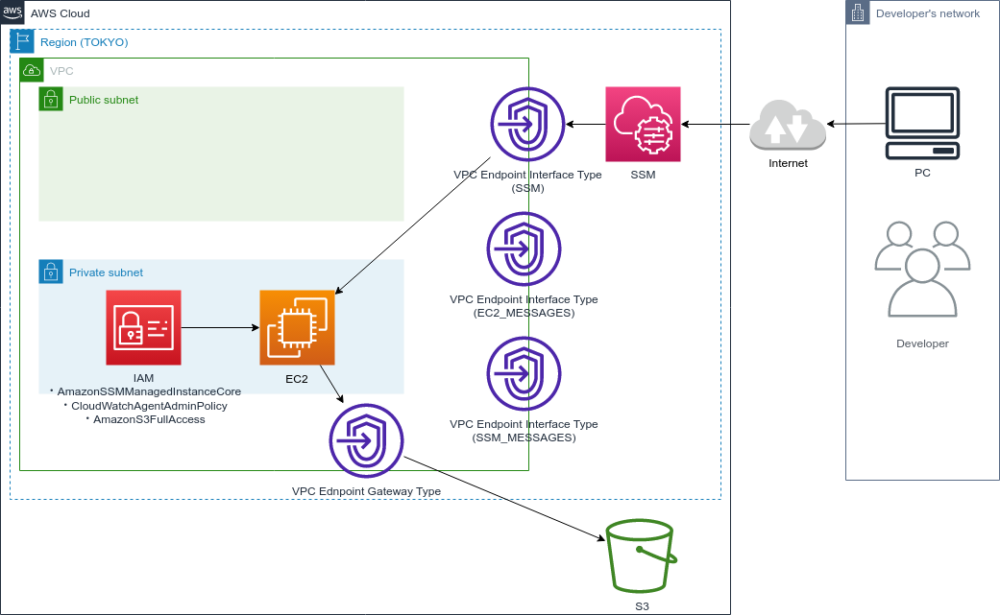

# aws-cdk-private-subnet-ec2-and-s3-ubuntu

## 構成図



## SSH アクセス

```bash
EC2_INSTANCE_ID=$(aws ec2 describe-instances \
    --filters "Name=tag:Name,Values=AwsCdkTemplate-AwsCdkTemplateStack/AwsCdkTemplate-AwsCdkTemplateStack-general_purpose_ec2" \
    --query "Reservations[].Instances[?State.Name=='running'].InstanceId[]" \
    --output text)
ssh -i ~/.ssh/ec2/id_ed25519 admis@$EC2_INSTANCE_ID
```

## S3 との疎通確認

- AWS CLI でアクセスする場合
  ※ リージョン指定しないと通らない
  ```bash
  aws s3 --region ap-northeast-1 ls
  aws s3 --region ap-northeast-1 ls s3://test-private-2023-0511
  ```
- curl でアクセスする場合
  ```bash
  $ curl https://[ BUCKET_NAME ].s3.ap-northeast-1.amazonaws.com/test.txt
  $ curl https://test-private-2023-0511.s3.ap-northeast-1.amazonaws.com/test.txt
  ```

## 認証情報の確認
```
aws configure list
```

---

## 参考情報

### CDK で EC2 に IAM Role を割り当てる

1. CfnInstance で EC2 を作成する場合
   `EC2InstanceRole.create()` で role を作成して，CfnInstanceProfile を通した後，CfnInstance に渡す（らしい）．
  - [AWS CDKでEC2にIAMロールを割り当てる時の覚書](https://wp-kyoto.net/add-iam-role-to-ec2-instance-by-aws-cdk/)
2. ec2.Instance で EC2 を作成する場合
   ソースコード参照

---

## 付録

### よく使うコマンド

#### テスト
```bash
npx npm run test
```
```bash
npx npm run test -- -u
```

#### デプロイ
```bash
npx cdk synth
```
```bash
npx cdk deploy --all --require-approval never
```
```bash
npx cdk destroy --all --force
```
